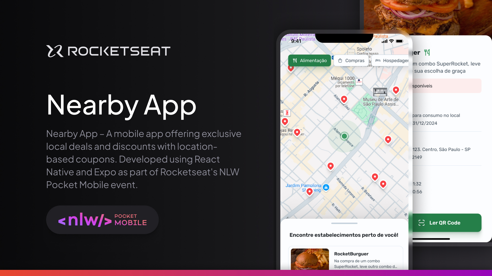

# Nearby App

Welcome to **Nearby App**, a mobile application that brings you exclusive benefits and discount coupons from establishments near you. Designed to enhance your shopping experience, the app connects users with local businesses, offering valuable deals right at their fingertips.

This project was developed as part of the **NLW Pocket Mobile** event, a learning experience provided by **Rocketseat**, aimed at empowering developers with cutting-edge mobile development skills.



## 🚀 Features

- **Exclusive Coupons:** Enjoy discounts from nearby establishments.
- **Geo-Based Offers:** Find the best deals tailored to your location.
- **User-Friendly Interface:** Seamless navigation with an intuitive design.

## 🛠 Technologies Used

- **Front-End:** React Native, Expo
- **Back-End:** Node.js, Prisma
- **Tools:** Figma (for design), Expo Go (for testing)

## 📂 Project Structure

```
mobile/
├── .expo/
├── .vscode/
├── assets/
│   ├── images/
│   │   └── thumbnail.jpg
│
├── nearby/
│   ├── nearby/
│   ├── nearby.xcodeproj/
│   ├── nearbyTests/
│   └── nearbyUITests/
│
├── node_modules/
├── src/
│   ├── app/
│   │   ├── market/
│   │   │   ├── _layout.tsx
│   │   │   ├── home.tsx
│   │   │   └── index.tsx
│   │   ├── assets/
│   │   │   ├── location.png
│   │   │   ├── logo.png
│   │   │   └── pin.png
│   │   ├── components/
│   │   │   ├── button/
│   │   │   ├── categories/
│   │   │   ├── category/
│   │   │   ├── loading/
│   │   │   ├── market/
│   │   │   ├── place/
│   │   │   ├── places/
│   │   │   ├── step/
│   │   │   ├── steps/
│   │   │   └── welcome/
│   │   ├── services/
│   │   │   └── api.ts
│   │   ├── styles/
│   │   │   ├── colors.ts
│   │   │   ├── font-family.ts
│   │   │   └── theme.ts
│   │   └── utils/
│
├── .gitignore
```

## 🏁 How to Run the Project

Follow these steps to set up and run the Nearby App locally:

1. **Start the API:**

   - Navigate to the external API folder (`api/`).
   - Run the following command to start the local API:
     ```bash
     npm start
     ```

2. **Start the Mobile Application:**
   - Navigate to the main project folder (`mobile/`).
   - Run the following command to start the app with Expo:
     ```bash
     npm expo start
     ```

## 📞 Contact

For inquiries or support, feel free to reach out:

- 🌐 LinkedIn: [linkedin.com/in/rodrigovaladao](https://www.linkedin.com/in/rodrigovaladao)

---

Thank you for exploring the **Nearby App**! Stay tuned for updates and exciting new features. 🚀
